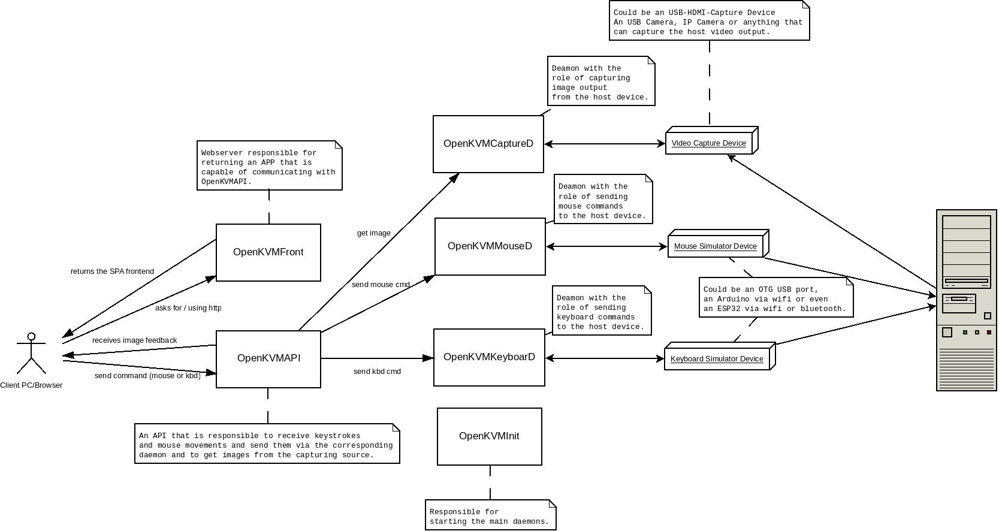

# openkvm-lab
A temporary repo to store my tests while trying to build openkvm.

## Project Overview

The idea is to expand the portability of pikvm. I mean, the Pi is so expensive right now that there are other boards that have the potential to be a cheaper replacement. So while trying to use pikvm on other board (by instance I mean my old Banana Pro) I got so many Pi-related dependencies that I ended giving up and starting a new project from scratch.

For now, I want this to have this simple goal:
- Create a codebase to allow one to control a pc remotely, by using a SBC that is capable of capture the host video and send keyboard and mouse commands through an otg port.

This is the main purpose of this repo. Once I can get one script that is able to do the above description, I can move to something bigger. 

Also, I like to organize my ideas using a diagram, so this is the initial footprint of the projects architecture:

